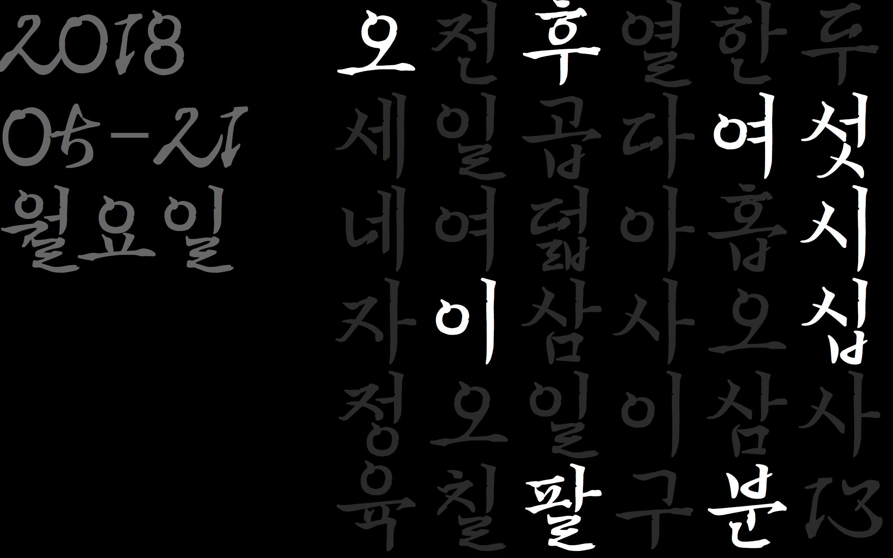

# Hangul Clock Screensaver(for mac)

맥용 한글 시계 스크린세이버 입니다.

[이순신체](http://www.asan.go.kr/font) 폰트가 필요합니다.

설치 : [다운로드](https://github.com/visu4l/Hangul-Clock-Screensaver-for-mac/releases/download/v1/ScreenHangulClock.saver.zip)

# License

CC Hangul Clock Screensaver(for mac) by (visu4l), CC BY NC SA 라이선스 (‘[Hangul Clock](https://github.com/suapapa/HangulClock) by Homin Lee, CC BY 라이선스’ 을 이용해 창작)

